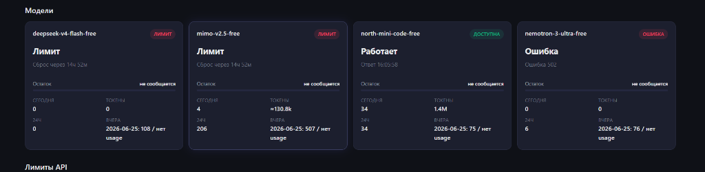
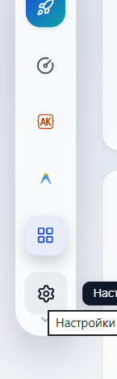

# 🌐 OpenCode Proxy

<p align="center">
  
</p>

<p align="center">
  <a href="https://github.com/ArtemPotapov52/opencode-proxy"></a>
  <a href="https://github.com/ArtemPotapov52/opencode-proxy/blob/main/LICENSE"></a>
  
  
  
  
</p>

---

## 📖 Overview

**OpenCode Proxy** is a lightweight, zero-dependency, OpenAI-compatible local proxy for the OpenCode Zen free models pool. It listens on `127.0.0.1:3000` by default and maps incoming requests to free models hosted on OpenCode Zen. This enables developers to use high-quality free models seamlessly within **OpenCode Desktop** and **Factory Droid** (Missions & Validation).

> [!NOTE]
> This is an independent community project. It is not built by, endorsed by, or affiliated with the official OpenCode team.

* **Русская инструкция**: [см. раздел на русском языке](#russian-setup).
* **Быстрый старт RU**: [QUICKSTART_RU.md](QUICKSTART_RU.md).

---

## 🕸️ UI & Flow Showcase

### 📊 Modern Sidebar Dashboard
Beautiful glassmorphism client dashboard featuring real-time statistics, active limits, observed models selector (stored in `localStorage`), and dark/light modes.
<p align="center">
  
</p>

### 🕸️ Interactive Request Flow
Visualize request pipelines, routing steps, target models, latency, and detailed status code fallbacks.
<p align="center">
  
</p>

---

## ✨ Core Features

- **⚡ Zero External Dependencies**: Powered entirely by the Node.js standard library (no bloated `node_modules` or Python setups).
- **🔀 Smart Routing**: Auto-fallbacks via `round-robin` or `random` strategies if a requested model is throttled or offline.
- **⏱️ Adaptive Probing**: Automatically pings throttled models. If a rate-limit reset is more than 10 minutes away, the probe interval decreases to 30 minutes to avoid upstream spamming.
- **📊 Observed Models Configurator**: Choose which models to pin to the dashboard on-the-fly via a settings panel.
- **🔔 Desktop Notifications**: Local desktop alerts trigger whenever a rate-limited model becomes available or if proxy health degrades.
- **🛡️ Privacy-Preserving**: Requests, responses, local file paths, API keys, and session IDs are never saved to disk.

---

## 📁 CLI Script Directory

The root folder contains helper scripts (`.cmd` for Windows) to simplify installation, usage, and diagnostic routines. Below is a map of their purposes:

### 🚀 Launchers & Installers
| Script | Description |
|---|---|
| [`.\run-opencode-proxy.cmd`](run-opencode-proxy.cmd) | **First-Time Setup**: Configures OpenCode Desktop and boots up the local proxy. |
| [`.\open-opencode.cmd`](open-opencode.cmd) | **Daily Launcher**: Verifies if the proxy is running (starts it if needed) and opens OpenCode Desktop. |
| [`.\start-proxy.cmd`](start-proxy.cmd) | **Autonomous Run**: Starts the proxy standalone in a background/console window. |
| [`.\install-opencode.cmd`](install-opencode.cmd) | Automated script to install `@ai-sdk/openai-compatible` extensions to OpenCode Desktop. |

### 🛠️ Factory Droid Tools
| Script | Description |
|---|---|
| [`.\setup-factory-droid.cmd`](setup-factory-droid.cmd) | Configures custom OpenCode models inside the Factory Droid settings folder. |
| [`.\doctor-factory.cmd`](doctor-factory.cmd) | Validates Factory Droid settings, active missions, and validation models. |
| [`.\factory-settings-backup.cmd`](factory-settings-backup.cmd) | Creates local settings backups/rollbacks for Factory Droid configuration files. |
| [`.\update-vibemode-factory.cmd`](update-vibemode-factory.cmd) | Migrates legacy NeuroGate configurations to the new VibeMode endpoint. |

### 🩺 Diagnostics & Utilities
| Script | Description |
|---|---|
| [`.\doctor.cmd`](doctor.cmd) | Runs checkups on Node.js, OpenCode config syntax, health checks, and models. |
| [`.\model-health.cmd`](model-health.cmd) | Verifies the real-time availability and HTTP statuses of all upstream free models. |
| [`.\proxy-status.cmd`](proxy-status.cmd) | Prints a compact CLI summary of requests, active rate limits, and latency from `/metrics`. |
| [`.\cleanup-usage.cmd`](cleanup-usage.cmd) | Prunes local RAM-logs or `usage.jsonl` database files. |
| [`.\secret-scan.cmd`](secret-scan.cmd) | Audits files for raw API keys, passwords, or configuration secrets. |
| [`.\build-release.cmd`](build-release.cmd) | Builds a source-only clean release `.zip` bundle. |

---

## ⚙️ Configuration Reference

The proxy is configured via environment variables or a `.env` file in the root directory.

| Variable | Default Value | Description |
|---|---|---|
| `OPENCODE_ZEN_API_KEY` | `public` | Auth key for the upstream OpenCode Zen API. |
| `HOST` | `127.0.0.1` | Network host to bind the proxy server. |
| `PORT` | `3000` | Port to run the proxy server on. |
| `MODELS` | *Default free pool* | Comma-separated models pool. |
| `PRIMARY_MODELS` | *Top 4 models* | Selected models displayed as top dashboard cards. |
| `ROUTING` | `round-robin` | Load balancing strategy: `round-robin` or `random`. |
| `UPSTREAM_URL` | `https://opencode.ai/zen/v1` | Upstream API endpoint. |
| `UPSTREAM_TIMEOUT` | `30000` (ms) | Requests timeout limit. |
| `MAX_BODY_BYTES` | `2097152` (2MB) | Max allowed body payload size. |
| `USAGE_DB_PATH` | *User config folder* | JSONL storage path for usage statistics. Set to `off` to disable. |
| `MANAGEMENT_TOKEN` | *Empty* | Token to restrict `/dashboard`, `/flow`, `/metrics` etc. |
| `PROBE_INTERVAL` | `30000` (ms) | Rate limit checking frequency. Set to `0` to disable. |

---

## 💻 Developer Guide

### Tests
Execute tests via the native Node.js test runner:
```bash
npm test
```

### Checks
Verify code rules and security requirements:
```powershell
npm run secret-scan
git diff --check
```

---

<a id="russian-setup"></a>
## 🇷🇺 Руководство пользователя (RU)

### Описание решения

Прокси-сервер разворачивает локальный OpenAI-совместимый порт:
`http://127.0.0.1:3000/v1`

**OpenCode Desktop** и **Factory Droid** общаются с ним как с локальным провайдером. Прокси перенаправляет запросы к оригинальному API `https://opencode.ai/zen/v1`, используя API-ключ `public` и распределяя нагрузку между доступными моделями:
- `deepseek-v4-flash-free`
- `mimo-v2.5-free`
- `north-mini-code-free`
- `nemotron-3-ultra-free`
- `big-pickle` (и другие)

> [!IMPORTANT]
> Это решение не обходит платные подписки и не гарантирует вечный безлимит. Доступность бесплатных моделей полностью контролируется апстримом OpenCode Zen.

---

### Быстрый старт для Windows

1. Установите **OpenCode Desktop**: [opencode.ai/download](https://opencode.ai/download) -> Windows x64 Desktop Beta.
2. Установите **Node.js 18+** с официального сайта [nodejs.org](https://nodejs.org/).
3. Скачайте или клонируйте этот репозиторий.
4. Откройте PowerShell в папке проекта и запустите первичную настройку:
   ```powershell
   .\run-opencode-proxy.cmd
   ```
   Скрипт автоматически добавит провайдера в конфиг OpenCode Desktop и запустит прокси.
5. Перезапустите OpenCode Desktop и в списке провайдеров выберите `Local Zen Proxy`.

Для последующих запусков рекомендуется использовать лаунчер, который автоматически проверяет запуск прокси перед открытием приложения:
```powershell
.\open-opencode.cmd
```

Панель мониторинга (Dashboard) доступна по адресу:  
👉 **`http://127.0.0.1:3000/dashboard`**

---

### Интеграция с Factory Droid (Missions & Validation)

Вы можете использовать этот прокси в качестве custom-модели для Factory Droid (например, если закончилась подписка на встроенные модели Factory).

1. Запустите прокси:
   ```powershell
   .\start-proxy.cmd
   ```
2. Выполните скрипт автонастройки:
   ```powershell
   .\setup-factory-droid.cmd
   ```
   Скрипт обновит конфигурации в `%USERPROFILE%\.factory\` и пропишет модели с суффиксом `[OpenCode Proxy]`.
3. Для проверки интеграции с Factory Droid запустите диагностику:
   ```powershell
   .\doctor-factory.cmd
   ```

---

### Управляющие скрипты (CLI Tools)

Для упрощения работы в корень проекта вынесены скрипты автоматизации:
- `.\doctor.cmd` — проверка окружения Node.js, настроек OpenCode и доступности эндпоинтов.
- `.\model-health.cmd` — сканирование доступности всех бесплатных моделей в режиме реального времени.
- `.\proxy-status.cmd` — вывод метрик работы прокси (запросы, ошибки, latency) прямо в консоль.
- `.\cleanup-usage.cmd --days 30` — ручная очистка истории использования старше 30 дней.

---

## 📄 License

This project is licensed under the MIT License - see the [LICENSE](LICENSE) file for details.
